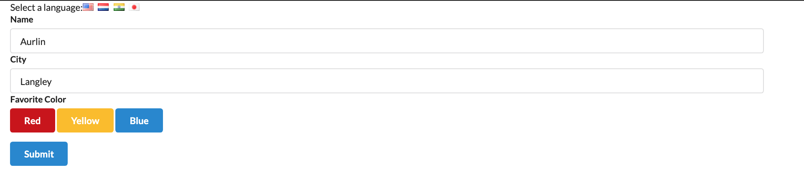

# language form

Questionnaire that a user can answer in languages such as English, Dutch, Japanese, or Punjabi. 

## Final Product




## Getting Started

1. Fork this repository, then clone it.
2. Install the dependencies using the `npm install` command.
3. Start the project by going into language-form and using the `npm start`The app will be served at <http://localhost:3000/>.
4. Go to <http://localhost:3000/> in your browser.

## Run the  language-form folder

```sh
npm start
```

## Dependencies

- react
- react-dom
- react-scripts

